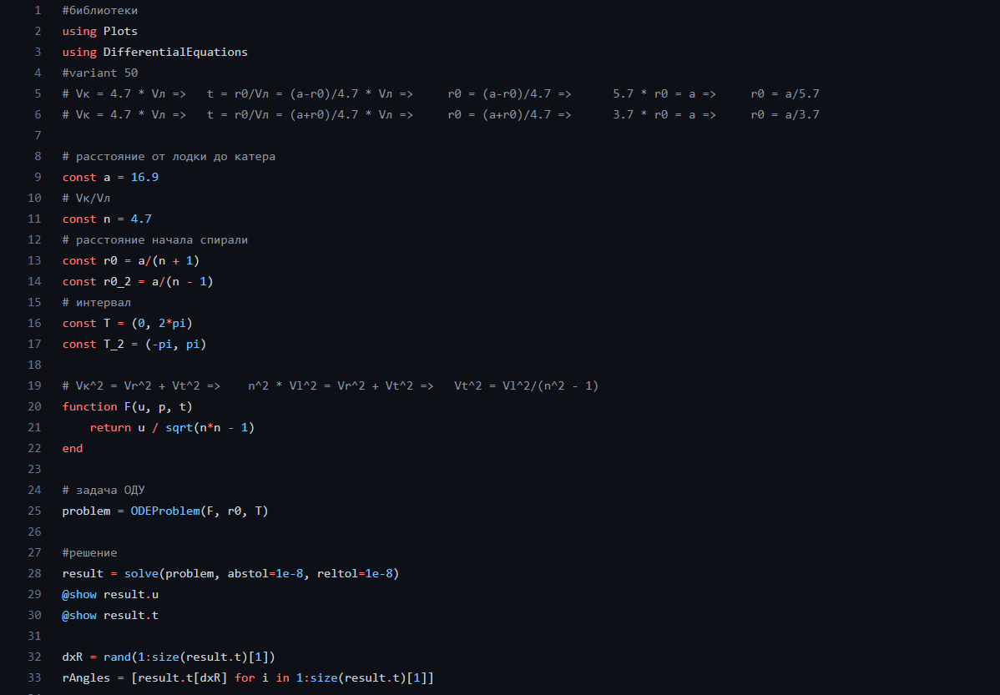
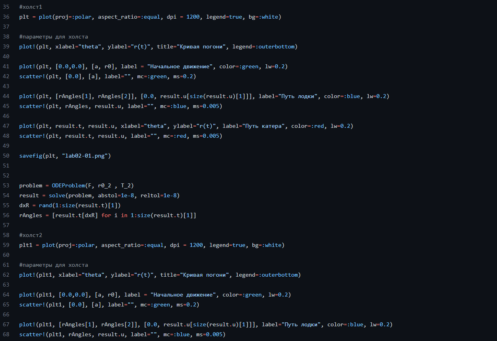
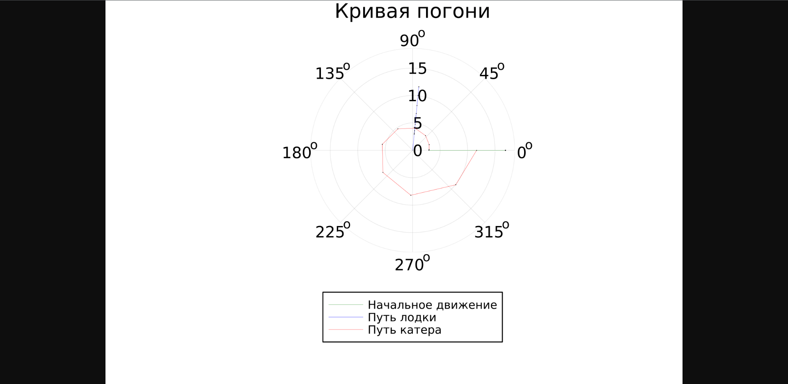

---
## Front matter
title: "Лабораторная работа № 2"
subtitle: "Задача о погоне"
author: "Го Чаопен"

## Generic otions
lang: ru-RU
toc-title: "Содержание"

## Bibliography
bibliography: bib/cite.bib
csl: pandoc/csl/gost-r-7-0-5-2008-numeric.csl

## Pdf output format
toc: true # Table of contents
toc-depth: 2
lof: true # List of figures
lot: false
fontsize: 12pt
linestretch: 1.5
papersize: a4
documentclass: scrreprt
## I18n polyglossia
polyglossia-lang:
  name: russian
  options:
	- spelling=modern
	- babelshorthands=true
polyglossia-otherlangs:
  name: english
## I18n babel
babel-lang: russian
babel-otherlangs: english
## Fonts
mainfont: PT Serif
romanfont: PT Serif
sansfont: PT Sans
monofont: PT Mono
mainfontoptions: Ligatures=TeX
romanfontoptions: Ligatures=TeX
sansfontoptions: Ligatures=TeX,Scale=MatchLowercase
monofontoptions: Scale=MatchLowercase,Scale=0.9
## Biblatex
biblatex: true
biblio-style: "gost-numeric"
biblatexoptions:
  - parentracker=true
  - backend=biber
  - hyperref=auto
  - language=auto
  - autolang=other*
  - citestyle=gost-numeric
## Pandoc-crossref LaTeX customization
figureTitle: "Рис."
tableTitle: "Таблица"
listingTitle: "Листинг"
lofTitle: "Список иллюстраций"
lotTitle: "Список таблиц"
lolTitle: "Листинги"
## Misc options
indent: true
header-includes:
  - \usepackage{indentfirst}
  - \usepackage{float} # keep figures where there are in the text
  - \floatplacement{figure}{H} # keep figures where there are in the text
---

# Цель работы

Целью данной работы является решение задачи о погоне на примере катера и лодки. 

# Задание

- Записать уравнение, описывающее движение катера, с начальными
условиями для двух случаев (в зависимости от расположения катера
относительно лодки в начальный момент времени). 
- Построить траекторию движения катера и лодки для двух случаев
- Найти точку пересечения траектории катера и лодки 

# Теоретическое введение

- Тангенциальная скорость [1] - составляющая вектора скорости, перпендикулярная линии, соединяющей источник и наблюдателя. Измеряется собственному движению - угловому перемещению источника.
- Радиальная скорость [2] — проекция скорости точки на прямую, соединяющую её с выбранным началом координат.
- Полярная система координат [3] — двумерная система координат, в которой каждая точка на плоскости определяется двумя числами — полярным углом и полярным радиусом.

# Выполнение лабораторной работы

1. Опишем начальные значения в варианте 50 (@fig:001).

{#fig:001 width=70%}

2. Введем полярные координаты. Полюс - это точка обнаружения
лодки, а полярная ось проходит через точку нахождения катера.

3. Чтобы найти расстояние x(расстояние после которого катер начнет двигаться вокруг полюса), необходимо составить простое уравнение. Пусть через время $t$ катер и лодка окажутся на одном расстоянии $x$ от полюса. За это время лодка пройдет $x$, а катер $k-x$ (или $k+x$, в зависимости от начального положения катера относительно полюса). Время, за которое они пройдут это расстояние, вычисляется как $x/v$ или $(k-x) / 5.7v$ (во втором случае $(k+x) / 5.7v$). Так как время одно и то же, то эти величины одинаковы. Составим уравнения и найдем растояние $x$ (@fig:002).

{#fig:002 width=70%}

4. После того, как катер окажется на одном расстоянии от полюса, что и лодка, он должен сменить прямолинейную траекторию и начать двигаться вокруг полюса удаляясь от него со скоростью лодки v.
Для этого скорость катера раскладываем на радиальную и тангенциальную скорости (@fig:003).

{#fig:003 width=70%}

5. Посчитаем траекторию движения браконьеров и движения лодки охраны и найдем точки пересечения при помощи следующего кода (@fig:004 - @fig:006).

{#fig:004 width=70%}

{#fig:005 width=70%}

{#fig:006 width=70%}

7. Получим изображения в качестве результата  (@fig:007 - @fig:008).

{#fig:007 width=70%}

{#fig:008 width=70%}

# Выводы

В ходе выполнения данной работы я научился работать с языком Julia с помощью решения задачи о погоне на примере лодки с браконьерами и береговой охраны.

# Список литературы{.unnumbered}

[1] http://www.astronet.ru/db/msg/1178122

[2] https://w.wiki/6MK$

[3] https://w.wiki/6ML2
