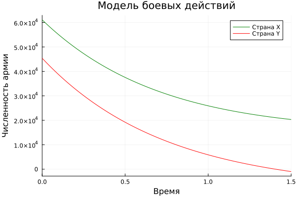
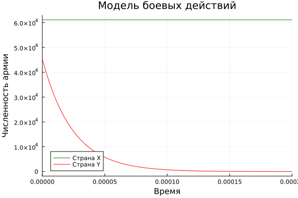
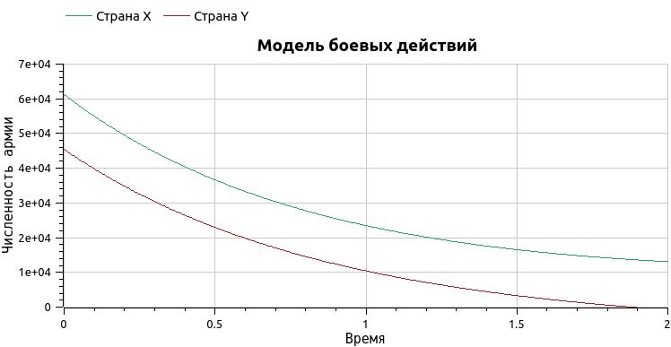
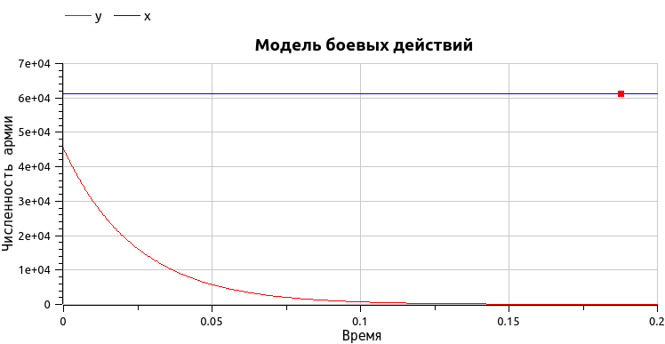

---
## Front matter
lang: ru-RU
title: Лабораторная работа №3
subtitle: Модель боевных действий
author:
  - Го Чаопен
institute:
  - Российский университет дружбы народов, Москва, Россия
date: 25.02.2023

## i18n babel
babel-lang: russian
babel-otherlangs: english

## Formatting pdf
toc: false
toc-title: Содержание
slide_level: 2
aspectratio: 169
section-titles: true
theme: metropolis
mainfont: PT Serif 
romanfont: PT Serif 
sansfont: PT Sans
monofont: PT Mono
header-includes:
 - \metroset{progressbar=frametitle,sectionpage=progressbar,numbering=fraction}
 - '\makeatletter'
 - '\beamer@ignorenonframefalse'
 - '\makeatother'
---

# Информация

## Докладчик

:::::::::::::: {.columns align=center}
::: {.column width="70%"}

  * Го Чаопен
  * студент НФИбд-02-20
  * Российский университет дружбы народов
  * [1032194919@pfur.ru]

:::
::::::::::::::

# Вводная часть

## Актуальность

- Работа с моделированием ситуации много где применяется
- Работа с графиками - наглядным представлением данных  


## Цели и задачи

- Соделирование боевые действия с помощью Julia и OpenModelica
- Представить результаты в виде графиков проанализировать
- Сравнить Julia и OpenModelica

## Материалы и методы

- Язык `Julia` и ее библиотеки: `Plots` и `DifferentialEquations` для построения графиков
- Свободное открытое программное обеспечение `OpenModelica` для моделирования ситуации
 
# Ход работы

## Построение моделей боя

1. Модель боевых действий между регулярными войсками описывается следующим ОДУ

  dx/dt = - ax(t) - bx(t) + P(t)  
  dy/dt = - cx(t) - hy(t) + Q(t) 
 
2. Модель ведение боевых действий с участием регулярных войск и
партизанских отрядов

  dx/dt = - a(t)x(t) - b(t)x(t) + P(t)  
  dy/dt = - c(t)x(t)y(t) - h(t)y(t) + Q(t)  

где: 
a,b,c,h - постоянные коэффициенты  
a(t), h(t) - коэффициенты, описывающие потери, не связанные с боевыми действиями  
c(t), b(t) - коэффициенты, описывающие потери, связанные с боевыми действиями  
P(t), Q(t) - функции, учитывающие возможность подхода подкрепления к войскам  


## Код для моделирования боя на Julia

```julia
#var 50
using Plots
using DifferentialEquations

# эффективность боевых действий со стороны у и x
a = -0.41
c = -0.52
# величины, характеризующие степень влияния различных факторов на потери
b = -0.89
h = -0.61
# P и Q - функцию, отвечающие за возможность подкрепления
#P(t) = sin(t+7) + 1
#Q(t) = cos(t+6) + 1
function P(t)
    p = sin(t+7) + 1
end

function Q(t)
    q = cos(t+6) + 1
end
# численность армии страны X
x1 = 61100
# численность армии страны Y
y1 = 45400

u0 = [x1,y1]
T = (0.0,1.5)
p = (a,b,c,h)

function F(du, u, p, t)
    a,b,c,h = p
    du[1] = a*u[1] + b*u[2] + P(t)
    du[2] = c*u[1] + b*u[2] + Q(t)
end

problem = ODEProblem(F, u0, T, p)

sol = solve(problem)

plt = plot(sol, vars=(0,1), color=:green, label="Страна X", title="Модель боевых действий", ylabel="Численность армии")
plot!(sol, vars=(0,2), color=:red, label="Страна Y", xlabel="Время")
savefig(plt, "lab3_1.png")

```

## Полученный график первой модели боя

{#fig:001 heigh=90% width=70%}

## Полученный график второй модели 

{#fig:002 heigh=90% width=70%}

## Код для моделирования первого боя на OpenModelica

```
model lab03
parameter Integer x1 = 61110;
parameter Integer y1 = 45400;
parameter Real a = -0.41;
parameter Real c = -0.52;
parameter Real b = -0.89;
parameter Real h = -0.61;
Real P;
Real Q;
Real x(start=x1);
Real y(start=y1);
equation
P=sin(time+7) + 1;
Q=cos(time+6) + 1;
der(x) = a*x + b*y + P;
der(y) = c*x + h*y + Q;
end lab03;
```


## График первой модели 

{#fig:003 heigh=90% width=70%}

## График второй модели

{#fig:004s heigh=90% width=70%}

# Результаты
## Результаты выполнения

- В результате моделирования были получены графики и навыки работы с ними
- Ознакомление с языками
- Сравнение Julia и OpenModelica

