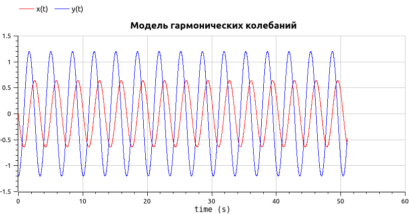
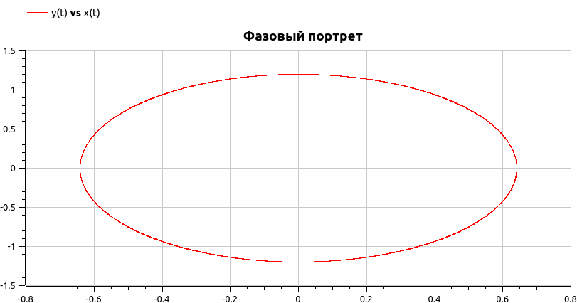
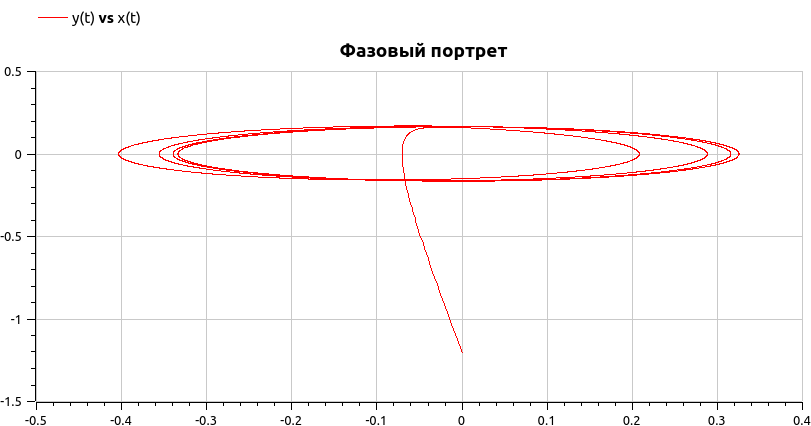
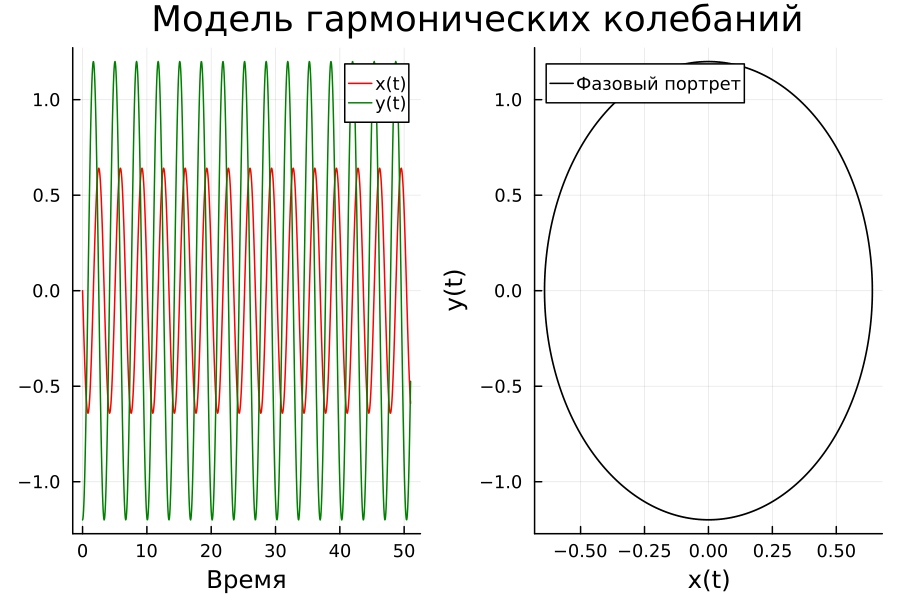

---
## Front matter
title: "Отчёт по лабораторной работе №4"
subtitle: "Модель гармонических колебаний"
author: "Го Чаопен"

## Generic otions
lang: ru-RU
toc-title: "Содержание"

## Bibliography
bibliography: bib/cite.bib
csl: pandoc/csl/gost-r-7-0-5-2008-numeric.csl

## Pdf output format
toc: true # Table of contents
toc-depth: 2
lof: true # List of figures
lot: true # List of tables
fontsize: 12pt
linestretch: 1.5
papersize: a4
documentclass: scrreprt
## I18n polyglossia
polyglossia-lang:
  name: russian
  options:
	- spelling=modern
	- babelshorthands=true
polyglossia-otherlangs:
  name: english
## I18n babel
babel-lang: russian
babel-otherlangs: english
## Fonts
mainfont: PT Serif
romanfont: PT Serif
sansfont: PT Sans
monofont: PT Mono
mainfontoptions: Ligatures=TeX
romanfontoptions: Ligatures=TeX
sansfontoptions: Ligatures=TeX,Scale=MatchLowercase
monofontoptions: Scale=MatchLowercase,Scale=0.9
## Biblatex
biblatex: true
biblio-style: "gost-numeric"
biblatexoptions:
  - parentracker=true
  - backend=biber
  - hyperref=auto
  - language=auto
  - autolang=other*
  - citestyle=gost-numeric
## Pandoc-crossref LaTeX customization
figureTitle: "Рис."
tableTitle: "Таблица"
listingTitle: "Листинг"
lofTitle: "Список иллюстраций"
lotTitle: "Список таблиц"
lolTitle: "Листинги"
## Misc options
indent: true
header-includes:
  - \usepackage{indentfirst}
  - \usepackage{float} # keep figures where there are in the text
  - \floatplacement{figure}{H} # keep figures where there are in the text
---

# Подготовил
### Го Чаопен 
### Группа НФИбд-02-20
### Студ. билет 1032194919

# Цель работы

Изучить методы математического моделирования на основе модели линейного гармонического осциллятора.

# Теоретическое введение
Движение грузика на пружинке, маятника, заряда в электрическом контуре, а
также эволюция во времени многих систем в физике, химии, биологии и других
науках при определенных предположениях можно описать одним и тем же
дифференциальным уравнением, которое в теории колебаний выступает в качестве
основной модели. Эта модель называется линейным гармоническим осциллятором. [@esystem-lab3]

# Задание

## Формулировка задания
 Вариант №50

Постройте фазовый портрет гармонического осциллятора [@ocszill] и решение уравнения
гармонического осциллятора для следующих случаев
1. Колебания гармонического осциллятора без затуханий и без действий внешней силы
$\ddot{x}+3.5x=0$
2. Колебания гармонического осциллятора c затуханием и без действий внешней силы
$\ddot{x}+11\dot{x}+11x=0$
3. Колебания гармонического осциллятора c затуханием и под действием внешней силы
$\ddot{x}+12\dot{x}+x=2\cos{0.5t}$
На итнтервале $t \in [ 0;51 ]$, шаг 0.05, $x_0=0, y_0=-1.2$


# Выполнение лабораторной работы

1. Начинаем работу с OpenModelica, так как он быстрее работает. [@openmodelicaODE]
Для первого случая написали следующий код:
```
model lab4_1
parameter Real omega_2 = 3.5;
parameter Real x0 = 0;
parameter Real y0 = -1.2;
Real x(start=x0);
Real y(start=y0);
equation
der(x) = y;
der(y) = -omega_2*x;
end lab4_1;
```
В симуляции получили сначала решение уравнения гармонического осциллятора (рис. @fig:001), и так же фазовый портрет (рис. @fig:002).

{#fig:001 width=70%}

{#fig:002 width=70%}

Далее написали код для второго случая:
```
model lab4_2
parameter Real omega_2 = 11;
parameter Real thetta = 11;
parameter Real x0 = 0;
parameter Real y0 = -1.2;
Real x(start=x0);
Real y(start=y0);
equation
der(x) = y;
der(y) = -thetta*y - omega_2*x;
end lab4_2;
```
В результате получили так же решение уравнения гармонического осциллятора (рис. @fig:003), и фазовый портрет (рис. @fig:004).

{#fig:003 width=70%}

{#fig:004 width=70%}

Для третьего уравнения написали следующий код
```
model lab4_3
parameter Real omega_2 = 1;
parameter Real thetta = 12;
parameter Real x0 = 0;
parameter Real y0 = -1.2;
Real x(start=x0);
Real y(start=y0);
equation
der(x) = y;
der(y) = -thetta*y - omega_2*x + 2*cos(0.5*time);
end lab4_3;
```
В результате получили сначала решение уравнения гармонического осциллятора (рис. @fig:005), и так же фазовый портрет (рис. @fig:006).

{#fig:005 width=70%}

{#fig:006 width=70%}

2. Далее пишем код на языке Julia [@juliaODE]. Код программы для первого уравнения выглядит следующим образом:
```julia
using Plots
using DifferentialEquations

#var 50

omega_2 = 3.5
tmin = 0
tmax = 51
T = (tmin, tmax)
x0 = 0
y0 = -1.2 
u0 = [x0,y0]

function F!(du, u, p, t)
    du[1] = u[2]
    du[2] = -omega_2*u[1]
end

problem = ODEProblem(F!, u0, T)
sol = solve(problem, saveat = 0.05, abstol = 1e-8, reltol = 1e-8)

X = []
Y = []
for u in sol.u
    x, y = u
    push!(X, x)
    push!(Y, y)
end

TT = sol.t 

plt = plot(dpi = 150, layout = (1,2), plot_title = "Модель гармонических колебаний")
plot!(plt[1], TT, [X, Y], color=[ :red :green], xlabel= "Время", label = ["x(t)" "y(t)"])
plot!(plt[2], X, Y, color = [:black], xlabel="x(t)", ylabel="y(t)", label="Фазовый портрет")
savefig(plt, "lab4_1.png")
```

В результате работы программы создались следующие графики (рис. @fig:007):

{ #fig:007 width=50% height=50% }

Код программы для второго уравнения выглядит следующим образом:
```julia
using Plots
using DifferentialEquations

#var 50

omega_2 = 11
thetta = 11
tmin = 0
tmax = 51
T = (tmin, tmax)
x0 = 0
y0 = -1.2 
u0 = [x0,y0]

function F!(du, u, p, t)
    du[1] = u[2]
    du[2] = -thetta*u[2] -omega_2*u[1] 
end

problem = ODEProblem(F!, u0, T)
sol = solve(problem, saveat = 0.05, abstol = 1e-8, reltol = 1e-8)

X = []
Y = []
for u in sol.u
    x, y = u
    push!(X, x)
    push!(Y, y)
end

TT = sol.t 

plt = plot(dpi = 150, layout = (1,2), plot_title = "Модель гармонических колебаний")
plot!(plt[1], TT, [X, Y], color=[ :red :green], xlabel= "Время", label = ["x(t)" "y(t)"])
plot!(plt[2], X, Y, color = [:black], xlabel="x(t)", ylabel="y(t)", label="Фазовый портрет")
savefig(plt, "lab4_2.png")
```
В результате работы программы создались следующие графики (рис. @fig:008):

{ #fig:008 width=50% height=50% }

Код программы для третьего уравнения выглядит следующим образом:
```julia
using Plots
using DifferentialEquations

#var 50

omega_2 = 1
thetta = 12
f(t) = 2*cos(0.5*t)
tmin = 0
tmax = 51
T = (tmin, tmax)
x0 = 0
y0 = -1.2 
u0 = [x0,y0]

function F!(du, u, p, t)
    du[1] = u[2]
    du[2] = -thetta*u[2] -omega_2*u[1] + f(t)
end

problem = ODEProblem(F!, u0, T)
sol = solve(problem, saveat = 0.05, abstol = 1e-8, reltol = 1e-8)

X = []
Y = []
for u in sol.u
    x, y = u
    push!(X, x)
    push!(Y, y)
end

TT = sol.t 

plt = plot(dpi = 150, layout = (1,2), plot_title = "Модель гармонических колебаний")
plot!(plt[1], TT, [X, Y], color=[ :red :green], xlabel= "Время", label = ["x(t)" "y(t)"])
plot!(plt[2], X, Y, color = [:black], xlabel="x(t)", ylabel="y(t)", label="Фазовый портрет")
savefig(plt, "lab4_3.png")
```

В результате работы программы создались следующие графики (рис. @fig:009):

{ #fig:009 width=50% height=50% }

# Выводы
Мы рассмотрели модель гармонических колебаний, провели анализ и вывод дифференциальных уравнений, а так жк построили графики зависимости наших переменных от времени и фазовые графики зависимостей.

# Список используемой литературы {.unnumberd}

