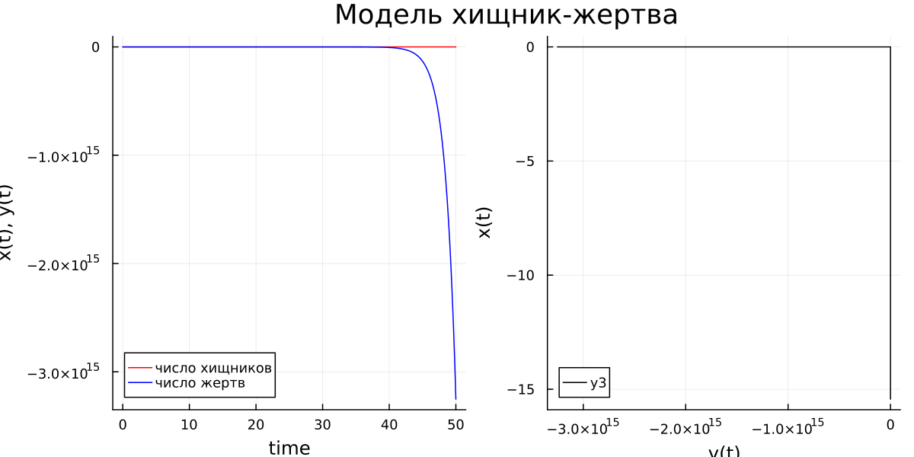
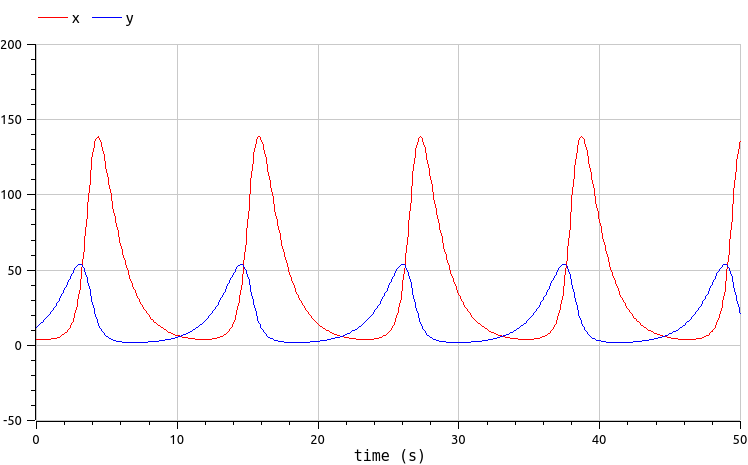
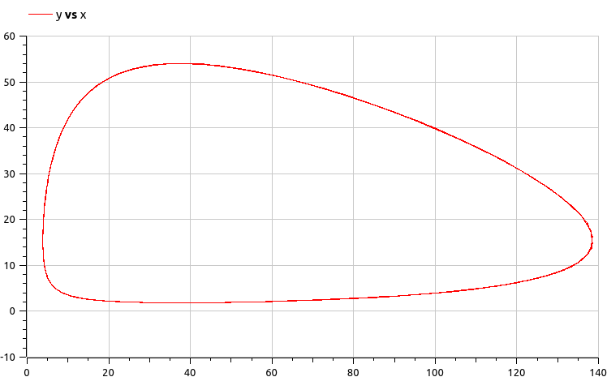
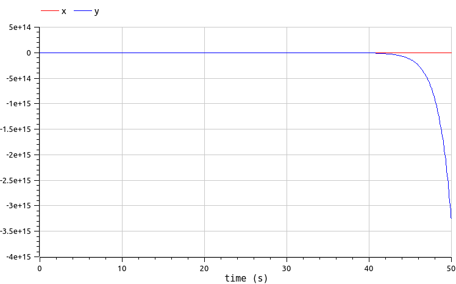
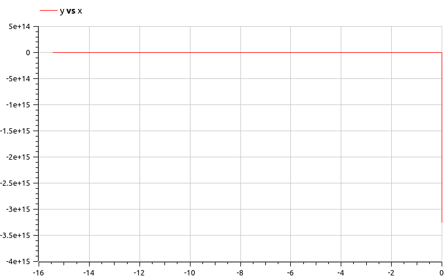

---
## Front matter
lang: ru-RU
title: Лабораторная работа №5
subtitle: Математическая модель «хищник-жертва»
author:
  - Го Чаопен
institute:
  - Российский университет дружбы народов, Москва, Россия
date: 11 марта 2023

## i18n babel
babel-lang: russian
babel-otherlangs: english

## Fonts
mainfont: PT Serif
romanfont: PT Serif
sansfont: PT Sans
monofont: PT Mono
mainfontoptions: Ligatures=TeX
romanfontoptions: Ligatures=TeX
sansfontoptions: Ligatures=TeX,Scale=MatchLowercase
monofontoptions: Scale=MatchLowercase,Scale=0.9

## Formatting pdf
toc: false
toc-title: Содержание
slide_level: 2
aspectratio: 169
section-titles: true
theme: metropolis
header-includes:
 - \metroset{progressbar=frametitle,sectionpage=progressbar,numbering=fraction}
 - '\makeatletter'
 - '\beamer@ignorenonframefalse'
 - '\makeatother'
---

# Информация

## Докладчик

:::::::::::::: {.columns align=center}
::: {.column width="70%"}

  * Го Чаопен
  * студент группы НФИбд-02-20
  * Российский университет дружбы народов
  * [1032194919@pfur.ru]

:::
::: {.column width="30%"}

:::
::::::::::::::

# Вводная часть

## Актуальность

- Необходимость навыков моделирования реальных математических задач, построение графиков.

## Объект и предмет исследования

- Язык программирования Julia
- Язык моделирования Modelica
- Математическая модель «хищник-жертва» (модель Лотки-Вольтерры)

## Цели и задачи

- Продолжить изучение функционала языков Julia и Modelica.
- Создать математическую модель Лотки-Вольтерры с помощью данных языков.
- Построить графики состояния систем в соответствии с поставленными задачами.

## Материалы и методы

- Языки:
  - язык программирования Julia
  - язык моделирования Modelica
- Дополнительный комплекс программ:
  - Программное обеспечение OpenModelica

# Ход работы

## Теоретический материал

Простейшая модель взаимодействия двух видов типа «хищник — жертва» -
модель Лотки-Вольтерры. Данная двувидовая модель основывается на
следующих предположениях:

1. Численность популяции жертв x и хищников y зависят только от времени
(модель не учитывает пространственное распределение популяции на
занимаемой территории)

2. В отсутствии взаимодействия численность видов изменяется по модели
Мальтуса, при этом число жертв увеличивается, а число хищников падает

3. Естественная смертность жертвы и естественная рождаемость хищника
считаются несущественными

## Теоретический материал

4. Эффект насыщения численности обеих популяций не учитывается

5. Скорость роста численности жертв уменьшается пропорционально
численности хищников

## Формулировка задания

Для модели «хищник-жертва»:

$$
\begin{cases}
    \frac{dx}{dt} = -0.71x(t) + 0.046x(t)y(t) 
    \\
    \frac{dy}{dt} = 0.64y(t) - 0.017x(t)y(t)
\end{cases}
$$

- $x$ – число жертв;

- $y$ - число хищников;

- $a$ - скорость естественного прироста числа жертв в отсутствие хищников;

- $b$ - естественный прирост жертв;

- $с$ - естественное вымирание хищников, лишенных пищи в виде жертв;

- $d$ - коэффициент смертности жертв;

## Формулировка задания

Построить график зависимости численности хищников от численности жертв, а также графики изменения численности хищников и численности жертв при следующих начальных условиях: $x_0 = 4$, $y_0 = 12$. Найти стационарное состояние системы.

# Julia
## Получившиеся графики при $x_0=4, y_0=12$

:::::::::::::: {.columns align=center}
::: {.column width=70%}

:::
::::::::::::::

## Получившиеся графики для стационарного состояния

:::::::::::::: {.columns align=center}
::: {.column width=70%}

:::
::::::::::::::

# OpenModelica
## Получившиеся графики при $x_0=4, y_0=12$

:::::::::::::: {.columns align=center}
::: {.column width="70%"}

:::
::::::::::::::

## Получившиеся графики при $x_0=4, y_0=12$

:::::::::::::: {.columns align=center}
::: {.column width="70%"}

:::
::::::::::::::

## Получившиеся графики для стационарного состояния

:::::::::::::: {.columns align=center}
::: {.column width="70%"}

:::
::::::::::::::

## Получившиеся графики для стационарного состояния

:::::::::::::: {.columns align=center}
::: {.column width="70%"}

:::
::::::::::::::

# Результаты

- Созданы математические модели Лотки-Вольтерры с помощью данных языков.

- Построены графики состояния систем в соответствии с поставленными задачами.

## Вывод

Продолжил знакомство с функционалом языка программирования Julia и языка моделирования Modelica, а также с функционалом программного обеспечения OpenModelica и интерактивного блокнота Pluto. Используя эти средства, построил математические модели «хищник-жертва» (модели Лотки-Вольтерры).
