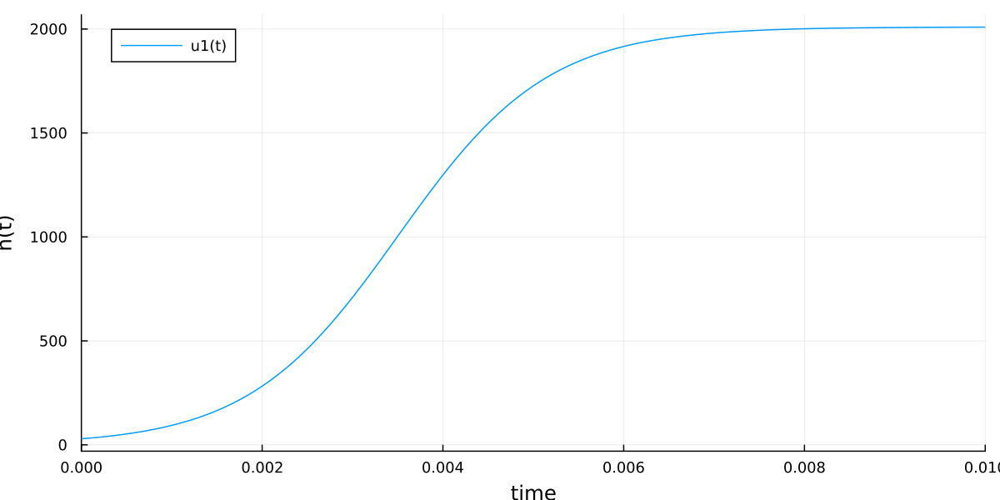

---
## Front matter
lang: ru-RU
title: Лабораторная работа №7
subtitle: Модель рекламной кампании
author:
  - Го Чаопэн
institute:
  - Российский университет дружбы народов, Москва, Россия
date: 25 марта 2023

## i18n babel
babel-lang: russian
babel-otherlangs: english

## Fonts
mainfont: PT Serif
romanfont: PT Serif
sansfont: PT Sans
monofont: PT Mono
mainfontoptions: Ligatures=TeX
romanfontoptions: Ligatures=TeX
sansfontoptions: Ligatures=TeX,Scale=MatchLowercase
monofontoptions: Scale=MatchLowercase,Scale=0.9

## Formatting pdf
toc: false
toc-title: Содержание
slide_level: 2
aspectratio: 169
section-titles: true
theme: metropolis
header-includes:
 - \metroset{progressbar=frametitle,sectionpage=progressbar,numbering=fraction}
 - '\makeatletter'
 - '\beamer@ignorenonframefalse'
 - '\makeatother'
---

# Информация

## Докладчик

:::::::::::::: {.columns align=center}
::: {.column width="70%"}

  * Го Чаопэн
  * студент уч. группы НФИбд-02-20
  * Российский университет дружбы народов
  * [1032194919@pfur.ru]

:::
::::::::::::::

# Вводная часть

## Актуальность

- Необходимость навыков моделирования реальных математических задач, построение графиков.

## Объект и предмет исследования

- Язык программирования Julia
- Язык моделирования Modelica
- Модель рекламной кампании

## Цели и задачи

- Продолжить знакомство с функционалом языков Julia и Modelica.
- Описать математическую модель рекламной кампании с помощью данных языков.
- Построить графики состояния систем в соответствии с поставленными задачами.

## Материалы и методы

- Языки:
  - язык программирования Julia
  - язык моделирования Modelica
- Дополнительный комплекс программ:
  - Программное обеспечение OpenModelica

# Процесс выполнения работы

# Формулировка задания

Постройте график распространения рекламы, математическая модель которой описывается следующим уравнением:

1. $\frac{dn}{dt} = (0.66 + 0.00006n(t))(N-n(t))$

1. $\frac{dn}{dt} = (0.00006+0.6n(t))(N-n(t))$

1. $\frac{dn}{dt} = (0.66 \cdot t + 0.6 \cdot t \cdot n(t))(N-n(t))$

При этом объем аудитории $N=610$, в начальный момент о товаре знает $10$ человек. Для случая 2 определите в какой момент времени скорость распространения рекламы будет иметь максимальное значение.

# Теоретическое введение

Математическая модель рекламной кампании описывается следующим ОДУ:

$$\frac{dn}{dt} = (\alpha_1(t) + \alpha_2(t)n(t))(N-n(t)), $$

где $N$ — число потенциальных клиентов; $n(t)$ — число клиентов, информированных о товаре и готовых его купить; $\frac{dn}{dt}$ — изменение числа клиентов, информированных о товаре и готовых его купить, со временем; $\alpha_1(t)$ — величина, характеризующая интенсивность рекламной компании; $\alpha_2(t)$ — величина, характеризующая интенсивность т.н. «сарафанного радио».

# Julia
## Получившийся график задания №1

:::::::::::::: {.columns align=top}
::: {.column width="60%"}

:::
::::::::::::::

## Получившийся график задания №2

:::::::::::::: {.columns align=center}
::: {.column width="60%"}

:::
::::::::::::::

## Получившийся график задания №3

:::::::::::::: {.columns align=center}
::: {.column width="60%"}

:::
::::::::::::::

# OpenModelica

## Получившийся график задания №1

:::::::::::::: {.columns align=center}
::: {.column width="60%"}

:::
::::::::::::::

## Получившийся график задания №2

:::::::::::::: {.columns align=center}
::: {.column width="60%"}

:::
::::::::::::::

## Получившийся график задания №3

:::::::::::::: {.columns align=center}
::: {.column width="50%"}

:::
::::::::::::::

# Результаты

- Описана математическая модель рекламной кампании с помощью языков Julia и Modelica.
- Построены графики состояния систем в соответствии с поставленными задачами.

## Вывод

Продолжил знакомство с функционалом языка программирования Julia и языка моделирования Modelica. Используя эти средства, построил математическую модель рекламной кампании.
