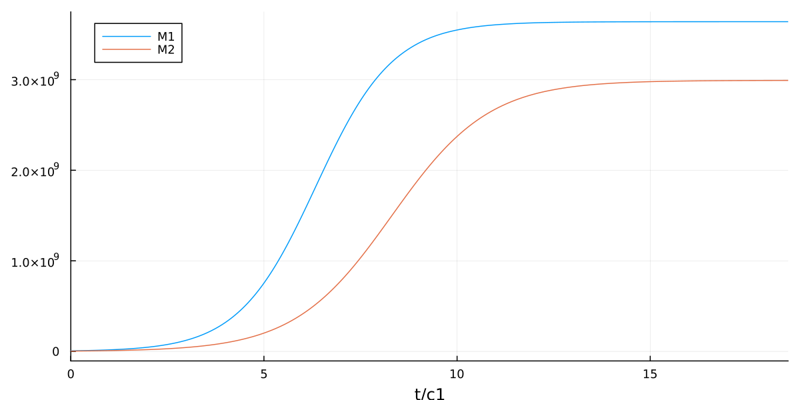
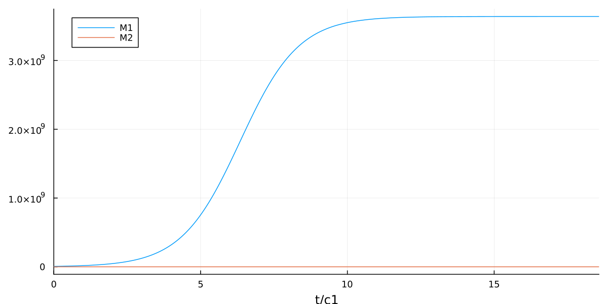
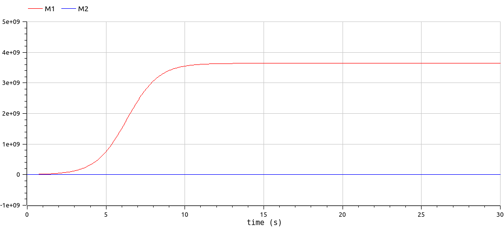

---
## Front matter
title: "Отчет по лабораторной работе №8"
subtitle: "по дисциплине: Математическое моделирование"
author: "Го Чаопэн"

## Generic otions
lang: ru-RU
toc-title: "Содержание"

## Bibliography
bibliography: bib/cite.bib
csl: pandoc/csl/gost-r-7-0-5-2008-numeric.csl

## Pdf output format
toc: true # Table of contents
toc-depth: 2
lof: true # List of figures
lot: false # List of tables
fontsize: 12pt
linestretch: 1.5
papersize: a4
documentclass: scrreprt
## I18n polyglossia
polyglossia-lang:
  name: russian
  options:
	- spelling=modern
	- babelshorthands=true
polyglossia-otherlangs:
  name: english
## I18n babel
babel-lang: russian
babel-otherlangs: english
## Fonts
mainfont: PT Serif
romanfont: PT Serif
sansfont: PT Sans
monofont: PT Mono
mainfontoptions: Ligatures=TeX
romanfontoptions: Ligatures=TeX
sansfontoptions: Ligatures=TeX,Scale=MatchLowercase
monofontoptions: Scale=MatchLowercase,Scale=0.9
## Biblatex
biblatex: true
biblio-style: "gost-numeric"
biblatexoptions:
  - parentracker=true
  - backend=biber
  - hyperref=auto
  - language=auto
  - autolang=other*
  - citestyle=gost-numeric
## Pandoc-crossref LaTeX customization
figureTitle: "Рис."
tableTitle: "Таблица"
listingTitle: "Листинг"
lofTitle: "Список иллюстраций"
lotTitle: "Список таблиц"
lolTitle: "Листинги"
## Misc options
indent: true
header-includes:
  - \usepackage{indentfirst}
  - \usepackage{float} # keep figures where there are in the text
  - \floatplacement{figure}{H} # keep figures where there are in the text
---

# Цель работы

Продолжить знакомство с функционалом языка программирования Julia, дополнительных библиотек (DifferentialEquations, Plots). Продолжить ознакомление с языком моделирования Modelica и программным обеспечением OpenModelica. Используя эти средства, описать математическую модель конкуренции двух фирм.

# Задание

Рассмотреть два случая конкуренции двух фирм: в первом случае борьба между фирмами ведется только рыночными методами. Во втором случае, помимо экономических факторов, борьба ведется при помощи социально-психологических факторов.

1. Построить графики изменения оборотных средств фирмы 1 и фирмы 2 без учета постоянных издержек и с веденной нормировкой для случая 1.

2. Постройте графики изменения оборотных средств фирмы 1 и фирмы 2 без учета постоянных издержек и с веденной нормировкой для случая 2.

# Теоретическое введение
## Актуальность

Математические модели конкуренции двух фирм широко используются для изучения поведения рынка и принятия бизнес-решений.

Модели конкуренции позволяют предсказать, как изменения в цене, спросе, затратах и других факторах влияют на прибыль и рыночную долю фирмы. Они также могут помочь определить оптимальные стратегии для достижения конкурентного преимущества на рынке.

Математические модели конкуренции двух фирм могут быть полезными для анализа различных сценариев и прогнозирования результатов, что может помочь фирмам принимать более обоснованные и продуманные решения. Они могут быть использованы для определения оптимальной цены продажи товара, управления запасами, оценки рисков и многого другого.

В целом, математические модели конкуренции позволяют более точно понимать конкуренцию на рынке и разрабатывать стратегии для улучшения позиций фирмы на нем [@spb].

## Предварительные замечания

Перед рассмотрением модели уместно сделать ряд предварительных замечаний:

1. Конкуренция имеет место между производителями взаимозаменяемых, часто однотипных, товаров.

2. Производители жизненно необходимых товаров, как правило, контролируются либо государством и часто являются естественными монополиями. В этих условиях роль конкуренции существенно снижается. Математические модели, рассматриваемые в данной лабораторной работе, не используются для моделирования конкуренции фирм, производящих данные товары.

3. Важным фактором конкуренции является качество товара. Понятие «качество» включает множество факторов: долговечность, прочность, удобство в эксплуатации, эстетика, и т.п. При этом первостепенным фактором при оценке товара является не само его качество, а отношение его цены к качеству. Для каждой страны данный фактор будет являться разным в связи с особенностью культуры, достатком граждан.

4. Производители принципиально новых товаров, не имеющих в данный момент времени взаимозаменяемых аналогов, создают свою рыночную нишу. Конкуренция в ней возникает, когда в неё внедряются другие производители. При этом, «качество» конечного товара может и не меняться, но себестоимость его снижается.

5. Очень важную роль при конкуренции играет реклама. По существу, речь идет о формировании общественного мнения, о преимуществах того или иного товара. Строго говоря, эта задача выходит за рамки экономических и связана с более общей проблемой: возникновения, эволюции и борьбы условных информаций.

6. Вступая в конкурентную борьбу, предприниматель может ставить следующие цели:
   - полностью вытеснить конкурента из определенной рыночной ниши;
   - Обеспечить себе определенную долю потребителей в условиях сосуществования с конкурентом (наиболее распространенный вариант);
   - Войти в рынок. Эта цель актуальна, если рынком владеет экономически сильный (обладающий большими средствами) конкурент, но не использующий инноваций.

Среди методов конкурентной борьбы можно условно выделить следующие группы.

1. __Чисто экономические (рыночные) методы__, не влияющие прямо на конкурента, но влияющие на рыночную цену. К ним относятся: сокращение производственного цикла, снижение себестоимости продукта. В компетенцию фирмы входит также и качество товара. Однако, как отмечалось выше, понятие «качества» многогранно и условно. Важно, что рыночная цена товара устанавливается в результате баланса спроса и предложения. Влиять на неё предприниматель может, только изменяя объем производства. В этом случае конкуренты непосредственно не взаимодействуют и получают информацию друг о друге через ситуацию на рынке. Эта модель в вербальной форме была рассмотрена Курно.

2. __Финансовые методы конкуренции__. Имеются в виду случаи, когда один из партнеров «назначает» низкую цену своего товара (ниже себестоимости), и в результате конкурент разоряется. Такой метод имеет специальное название – демпинг. Речь идет о наводнении рынка товаром, в результате чего рыночная цена опускается ниже уровня себестоимости товара конкурента. При этом оба конкурента терпят убытки, и вопрос заключается в том, кто из них раньше разорится. Ясно, что на демпинг может решиться конкурент, обладающий запасом средств, которые он использует для дотаций своего производства в течение большого (но не бесконечного) времени. В целом, эта акция может иметь смысл, если в результате ее конкурент полностью вытесняется с рынка.

3. __Методы, выходящие за рамки чисто экономических__. Легальным методом такого типа является реклама. Не меньшую роль играет антиреклама, то есть, создание негативного отношения к товару конкурента. Формально она запрещена, но реально всегда имеет место даже вне зависимости от действий предпринимателя. К этой же группе относятся криминальные методы [@crim].


## Модель одной фирмы

ОДУ, представляющая собой модель изменения числа оборотных средств одного предприятия:

$$\frac{dM}{dt} = M \frac{\delta}{\tau} (\frac{p_{cr}}{\tilde p} - 1) - M^2(\frac{\delta}{\tau \tilde p})^2 \frac{p_{cr}}{Nq} - \mathcal{K}, $$

где $M$ — оборотные средства предприятия; $\delta$ — доля оборотных средств, идущая на покрытие переменных издержек; $\tilde p$ — себестоимость продукта; $p$ — рыночная цена товара; $\tau$ — длительность производственного цикла; $N$ — число потребителей производимого продукта; $q$ — максимальная потребность одного человека в продукте в единицу времени; $\mathcal{K}$ — постоянные издержки, не зависящие от количества выпускаемой продукции.

## Модель конкуренции двух фирм
### Случай 1

Рассмотрим случай конкуренции между двумя фирмами, которые ведут борьбу только рыночными методами (конкуренты могут влиять на противника только путем изменения параметров своего производства). При этом товары, производимые обоими фирмами, имеют одинаковое качество, находятся в одной рыночной нише, а у потребителей нет априорных предпочтений, товар какой фирмы выбирать. В этом случае, на рынке устанавливается единая цена, которая определяется балансом суммарного предложения и спроса.

Система уравнений для первого случая принимает вид:

$$\frac{dM_1}{d\theta} = M_1 - \frac{b}{c_1} M_1 M_2 - \frac{a_1}{c_1} M_1^2 $$

$$\frac{dM_2}{d\theta} = \frac{c_2}{c_1}M_2 - \frac{b}{c_1} M_1 M_2 - \frac{a_2}{c_1} M_2^2, $$

где $\delta = \frac{t}{c_1}$ — нормировка времени (безразмерное время), $a_1 = \frac{p_{cr}}{\tau_1^2 \tilde p_1^2 Nq}$, $a_2 = \frac{p_{cr}}{\tau_2^2 \tilde p_2^2 Nq}$, $b = \frac{p_{cr}}{\tau_1^2 \tilde p_1^2 \tau_2^2 \tilde p_2^2 Nq}$, $c_1=\frac{p_{cr} - \tilde p_1}{\tau_1 \tilde p_1}$, $c_2=\frac{p_{cr} - \tilde p_2}{\tau_2 \tilde p_2}$.

При этом считается, что ценовое равновесие устанавливается быстро, а постоянные издержки $\mathcal{K}_1, \ \mathcal{K}_2$ пренебрежимо малы.

Также заметим, что $p_{cr}, \ \tilde p_{1, 2}, \ N$ указаны в тысячах единиц, а значения $M_{1, 2}$ — в миллионах единиц.

### Случай 2

Рассмотрим случай конкуренции между двумя фирмами, при котором, помимо рыночной борьбы, компаниями используются еще и социально-психологические факторы — формирование общественного предпочтения одного товара другому, не зависимо от их качества и цены.

В данном случае система уравнений принимает вид:

$$\frac{dM_1}{d\theta} = M_1 - \frac{b}{c_1} M_1 M_2 - \frac{a_1}{c_1} M_1^2 $$

$$\frac{dM_2}{d\theta} = \frac{c_2}{c_1}M_2 - (\frac{b}{c_1} + 0.00031) M_1 M_2 - \frac{a_2}{c_1} M_2^2, $$

где все обозначения остаются прежними, а коэффициент, появляющийся во втором слагаемом в первом уравнении, отвечает за социально-психологические факторы [@rudn].


# Выполнение лабораторной работы
## Julia
### Задание №1

1. Пишем программу, воспроизводящую модель на языке программирования Julia. Получаем результат в виде графика (рис. @fig:01).

    ```Julia
    using Plots;
    using DifferentialEquations;

    const M1_0 = 6.4 * 1e6
    const M2_0 = 4.1 * 1e6
    const p_cr = 20 * 1e3
    const N = 40 * 1e3
    const q = 1
    const tau1 = 20
    const tau2 = 15
    const p1 = 7 * 1e3 
    const p2 = 9.5 * 1e3

    const a1 = p_cr / (tau1 ^ 2 * p1 ^ 2 * N * q)
    const a2 = p_cr / (tau2 ^ 2 * p2 ^ 2 * N * q)
    const b = p_cr / (tau1 ^ 2 * p1 ^ 2 * tau2 ^ 2 * p2 ^ 2 * N * q)
    const c1 = (p_cr - p1)/ (tau1 * p1)
    const c2 = (p_cr - p2)/ (tau2 * p2)

    u0 = [M1_0, M2_0]
    T = (0.0, 200 * c1)

    function F!(du, u, p, t)
        du[1] = u[1] - (b/c1)*u[1]*u[2] - (a1/c1)*u[1]^2
        du[2] = (c2/c1)*u[2] - (b/c1)*u[1]*u[2] - (a2/c1)*u[2]^2
    end 

    prob = ODEProblem(F!, u0, T)
    sol = solve(prob)
    plt = plot(sol, dpi =150, size = (800, 400), xlabel = "t/c1", label = ["M1" "M2"])
    savefig(plt, "img_lab8_1.png")
    ```

    {#fig:01 width=86%}


### Задание №2

1. Изменил второе уравнение в функции `F!`. Остальные блоки кода оставлены без изменений. Получаем результат в виде графика (рис. @fig:02).

    ```Julia
    function F!(du, u, p, t)
        du[1] = u[1] - (b/c1)*u[1]*u[2] - (a1/c1)*u[1]^2
        du[2] = (c2/c1)*u[2] - (b/c1 + 0.00031)*u[1]*u[2] - (a2/c1)*u[2]^2
    end 
    ```
    
    {#fig:02 width=86%}


## Modelica
### Задание №1

1. По аналогии с Julia пишем программу, воспроизводящую модель конкуренции двух фирм на языке моделирования Modelica с использованием ПО OpenModelica. Получаем результат в виде графика (рис. @fig:03).
    
    ```
    model lab8_1
      constant Real M1_0 = 6.4 * 1e6;
      constant Real M2_0 = 4.1 * 1e6;
      constant Integer p_cr = 20 * integer(1e3);
      constant Integer N = 40 * integer(1e3);
      constant Integer q = 1;
      constant Integer tau1 = 20;
      constant Integer tau2 = 15;
      constant Real p1 = 7 * integer(1e3);
      constant Real p2 = 9.5 * integer(1e3);
      
      constant Real a1 = p_cr / (tau1 ^ 2 * p1 ^ 2 * N * q);
      constant Real a2 = p_cr / (tau2 ^ 2 * p2 ^ 2 * N * q);
      constant Real b = p_cr / (tau1 ^ 2 * p1 ^ 2 * tau2 ^ 2 * p2 ^ 2 * N * q);
      constant Real c1 = (p_cr - p1)/ (tau1 * p1);
      constant Real c2 = (p_cr - p2)/ (tau2 * p2);
      Real t = time/c1;
      Real M1(t);
      Real M2(t);
    initial equation
      M1 = M1_0;
      M2 = M2_0;
    equation
      der(M1) = M1 - (b/c1)*M1*M2 - (a1/c1)*M1^2;
      der(M2) = (c2/c1)*M2 - (b/c1)*M1*M2 - (a2/c1)*M2^2;
    end lab8_1;
    ```

    {#fig:03 width=86%}


### Задание №2

1. По аналогии с Julia пишем программу для второго случая. Получаем результат в виде графика (рис. @fig:04).


    {#fig:04 width=86%}

# Анализ результатов

На текущем примере построения математической модель конкуренции двух фирм мы можем продолжить сравнивать язык программирования Julia и язык моделирования Modelica. Хотелось бы ещё раз подчеркнуть, что в Modelica в разы удобнее составлять уравнения, т.к. все переменные, зависящие от времени, подписываются заданными ранее символами в отличие от Julia, где каждой переменной соответствует элемент массива. Такая реализация может запутать, что может привести к ошибкам, связанным с усидчивостью, при описании модели. При выполнении данной лабораторной работы данный недостаток проявил себя, значительно усложнив отладку кода.

В связи с тем, что данная лабораторная работа является последней в рамках курса, было бы разумно подвести определенные итоги в сравнении языков Julia и Modelica.

Если быть откровенным, язык Julia мне понравился больше, нежели Modelica. В первую очередь это связано с тем, что Julia является языком программирования, и процесс написания программ на нем в разы более понятен и эффективен для студента информационного направления. Также алгоритмическая «гибкость» позволяет реализовывать более сложные и информативные структуры (к примеру, анимированные графики), четко отражающие все важные аспекты математической модели.

С другой стороны, язык моделирования Modelica в большинстве случаев позволяет не тратить длительное время на разработку программы, и почти сразу же после начала выполнения лабораторной работы получить приемлемый результат. Меньшая длина кода и большая его читабельность позволяет в разы проще реализовывать математические модели с помощью данного языка, при этом в определенных моментах теряя дополнительную информативность в результате симуляции модели.

# Выводы

Продолжил знакомство с функционалом языка программирования Julia, дополнительных библиотек (DifferentialEquations, Plots). Продолжил ознакомление с языком моделирования Modelica и программным обеспечением OpenModelica. Используя эти средства, описал математическую модель конкуренции двух фирм.


# Список литературы{.unnumbered}

::: {#refs}
:::
